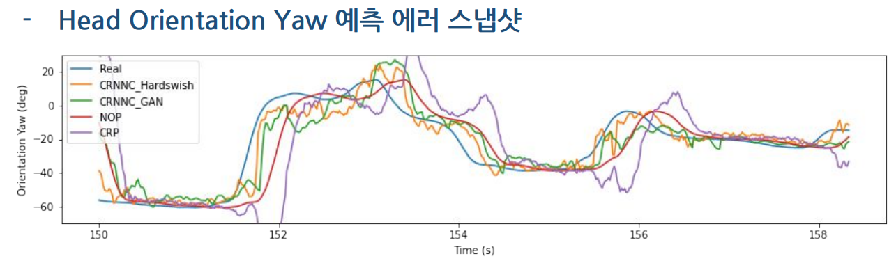
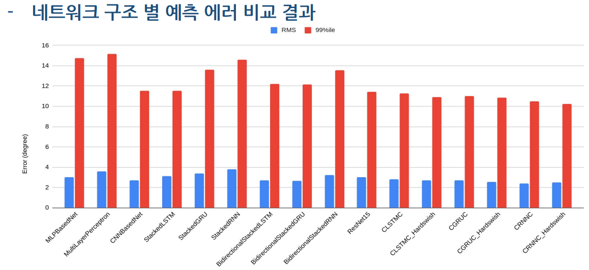
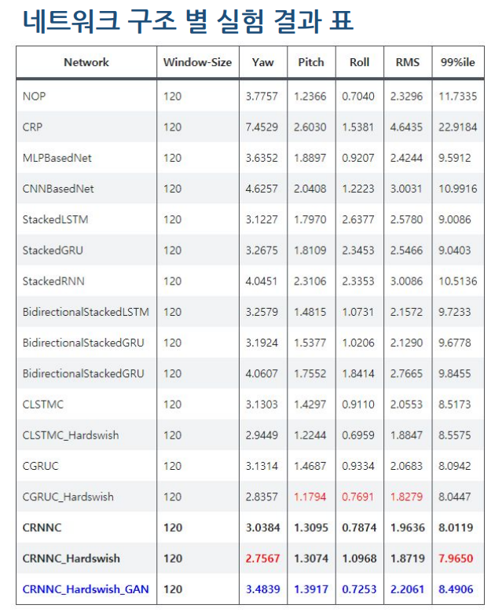

# Head Orientation Prediction







# Docs

[Final Presentation](Final%20Report.pdf)

# Requirements

- numpy
- pytorch
- tqdm
- torch_burn # `pip install git+https://github.com/kitsunetic/torch_burn@0.0.3.8`

# Usage

```bash
# Experiment directory will be automatically generated in the results folder.
# "results/0000-CRNNC_Hardswish-win_120-epoch_200-batch_size_256[-comment]"  
python run_training.py \
  --window-size 120 \
  --epochs 200 \
  --batch-size 256 \
  --cpus 8 \
  --network CRNNC_Hardswish \
  --dataset data/1116 \
  --result results \
  --comment {any comment or not}
```

# Supported Networks

- MLPBasedNet
- CNNBasedNet
- StackedRNN
- StackedGRU
- StackedLSTM
- BidirectionalStackedRNN
- BidirectionalStackedGRU
- BidirectionalStackedLSTM
- ResNet15
- CLSTM
- CLSTMC
- CRNNC
- CGRUC
- CRNNC_PReLU
- CRNNC_ReLU
- CRNNC_Hardswish
- CRNNC_Tanh
- CLSTM_Hardswish
- CGRUC_Hardswish
- CRNNC_Hardswish
- CLSTMC_Hardswish_FC
- CGRUC_Hardswish_FC
- CRNNC_Hardswish_FC
- CRNNC5
- InceptionModel
